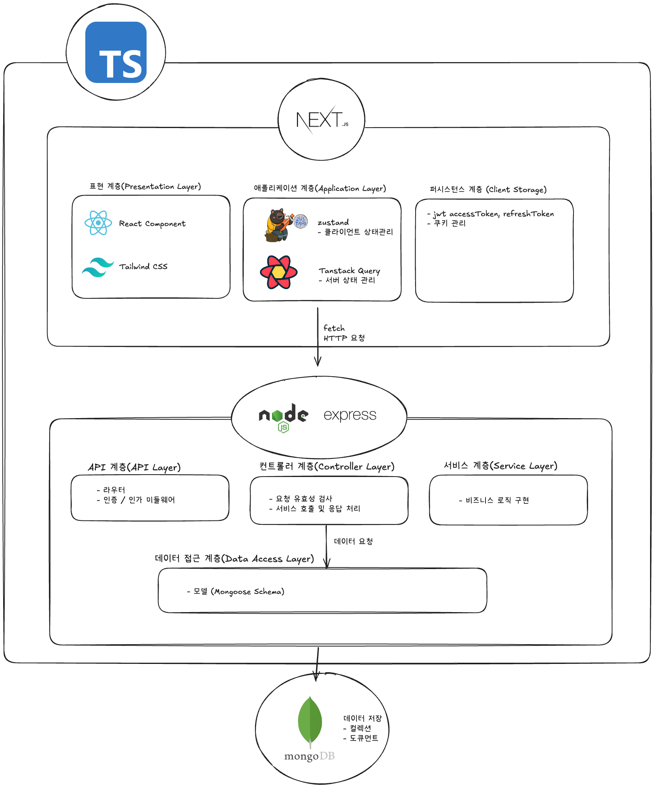

# Blog_Nodes:  Next.js, Node.js, MongoDB 기반의 풀스택 블로그 서비스

| 🔗 배포 주소 | [바로가기](https://my-blog-hayden-365.vercel.app/) |

## 1. 프로젝트 소개 (Project Overview)

Tistory 블로그의 접근성과 Notion 및 Obsidian의 유연한 지식 관리 방식을 경험하며, 각 도구의 장점들을 결합한 저만의 블로그 플랫폼에 대한 필요성을 느끼게 되었습니다. 이러한 배경에서 **Blog_Nodes**는 개인 지식 관리와 포트폴리오 추적을 위한 맞춤형 블로그 서비스로 개발되었습니다.

본 프로젝트의 핵심 특징은 포스트 하나에 태그, 타입, 그리고 프로젝트 속성을 부여하여 정보의 구조화 및 상호 연계성을 강화했다는 점입니다. 궁극적으로는 이러한 속성 기반의 연결성을 활용하여 Obsidian과 유사한 **그래프 뷰(Graph View)**를 활성화함으로써, 지식 간의 유기적인 관계를 시각적으로 파악하고 탐색할 수 있도록 발전시킬 예정입니다.

또한, 각 포스트의 프로젝트 속성을 통해 관련 포스트들을 한데 모아 포트폴리오 페이지로 조회할 수 있는 기능을 제공하여, 개발 프로젝트의 진행 상황과 결과물을 효과적으로 추적하고 시각화할 수 있도록 설계되었습니다.

향후에는 SEO(검색 엔진 최적화) 기능 강화 및 블로그 데이터 추적 시스템 추가를 통해 개인 브랜딩과 콘텐츠 관리의 효율성을 더욱 높일 계획입니다.

## 2. 주요 기능 (Key Features)

Blog_Nodes는 다음과 같은 핵심 기능을 제공합니다.

- 사용자 인증 (Google OAuth):

  - 현재는 관리자(본인)만 로그인 가능하도록 제한되어 있습니다.

- 포스트 관리:

  - 포스트 조회
  - 포스트 작성
  - 포스트 수정

  - 포스트 삭제

- 프로젝트 관리:

  - 프로젝트 생성

  - 프로젝트 페이지 조회

  - 프로젝트에 해당되는 포스트 목록 조회

## 3. 프로젝트 아키텍처

1. **전반적인 구조**  
   프로젝트는 크게 세 가지 주요 부분으로 구성됩니다: 프론트엔드 (Next.js), 백엔드 (Node.js/Express), 그리고 데이터베이스 (MongoDB). 각 계층은 독립적인 책임을 가지며, 상호 간의 통신은 표준 RESTful API를 통해 이루어집니다. 
2. **프론트엔드 (Next.js)**  
   Next.js 프레임워크를 사용하여 서버 사이드 렌더링(SSR), 정적 사이트 생성(SSG) 등의 기능을 활용하고 React 기반으로 UI를 구성합니다. **On-Demand Revalidation**을 통해 데이터 변경 시 즉시 캐시를 무효화하여 최신 콘텐츠를 제공합니다. 
3. **백엔드 (Node.js/Express)**  
   Node.js 런타임 환경 위에서 Express.js 프레임워크를 사용하여 구현되었습니다. 계층형 아키텍처를 통해 각 기능의 책임을 명확히 분리합니다.
    다만, 현재의 코드는 api계층과 컨트롤러 계층이 통합되어있지만, 우선적으로 리팩토링이 이뤄질 계획입니다. 
4. **데이터베이스 (MongoDB)**  
   애플리케이션의 모든 영속적인 데이터 저장을 위해 MongoDB를 사용합니다. 데이터는 컬렉션(Collection) 내에 도큐먼트(Document) 형태로 저장되며, 이는 JSON과 유사한 형태를 가집니다.

## 4. On-Demand Revalidation 설정

### 캐시 태그 구조

- **포스트 관련**: `posts`, `post-{id}`, `posts-{tag}`
- **프로젝트 관련**: `projects`, `project-{id}`
- **태그 관련**: `tags`, `tag-search`

### 사용법

1. **포스트 생성/수정/삭제 시**: 자동으로 관련 캐시가 무효화됩니다.
2. **프로젝트 생성/수정/삭제 시**: 자동으로 관련 캐시가 무효화됩니다.
3. **수동 캐시 무효화**: API 엔드포인트 `/api/revalidate`를 통해 수동으로 캐시를 무효화할 수 있습니다.
